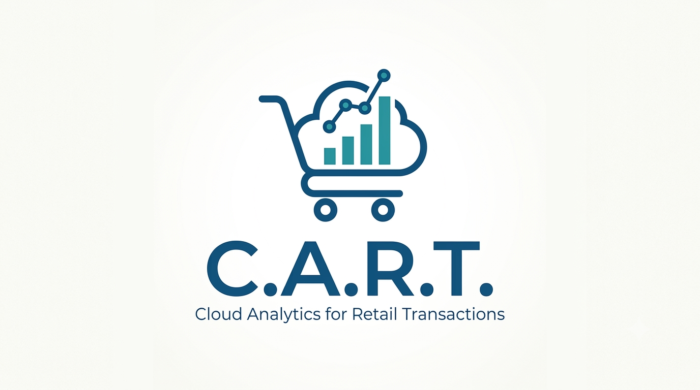

# CART (Cloud Analytics for Retail Transactions)

**C.A.R.T.** (Cloud Analytics for Retail Transactions) is an end-to-end Big Data pipeline designed to extract actionable business insights from e-commerce logs. Built on **Google Cloud Platform (GCP)** and **Databricks**, the project leverages **Apache Spark** and **Delta Lake** for scalable ETL processing, transforming raw CSV data into an optimized **Star Schema**. It also features advanced Machine Learning for customer segmentation (K-Means) and Market Basket Analysis (FP-Growth), culminating in a live, interactive business intelligence dashboard powered by **Data Studio**.

### Getting Started

For a comprehensive, step-by-step guide on how to configure the Google Cloud environment and reproduce the entire pipeline, please refer to the **[Setup Guide](./docs/setup.md)**.

### Dashboard

To view the dashboard, visit [link](https://datastudio.google.com/reporting/af24e783-7d7a-4c72-b2cc-e2d318e47112).